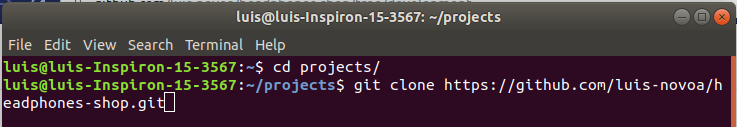

# Co-Life

In this project, I built the API of Co-Life, an app focused on advertising co-living opportunities. You can use this API to can create and manage your account, your ads and your favorite list. I also added administrator privileges to one account. Check the [documentation](https://raw.githack.com/luis-novoa/co-life-doc/gh-pages/index.html) to understand how to interact with it.

## Built With

- Ruby v2.6.5
- Ruby on Rails v6.0.3.1
- Visual Studio Code

## Live Demo

Send HTTP requests to [https://co-life.herokuapp.com/](https://runnerln.herokuapp.com/) to interact with the API!

## Getting Started

This project is open for anyone who wants to clone it and create their version. If you just want the files and don't want to make further changes, follow the steps below to get a copy in your computer:

1 - Install git in your machine. Follow [this guide](https://www.theodinproject.com/courses/web-development-101/lessons/setting-up-git) by The Odin Project if you haven't done so.

2 - On this repository, click on the "Clone or download" button and copy the URL address provided.


3 - Open your terminal, select the folder where you want to store this project and paste the following code
```
git clone <copiedUrl>
```


Now you have the project files in your computer, but you'll not be able to save any changes on github since you're not the owner or a collaborator of this project. If you want to that, you can fork this project clicking the "Fork" button in the repository's page, which will create a repository named "<yourUserName>/headphones-shop". Follow the aforementioned instructions to download it to your computer.


Now you can edit the project as you please and save your changes on your forked repository on github following the git flow. If you're not familiarized with this concept, follow [this guide about the Git Basics](https://www.theodinproject.com/courses/web-development-101/lessons/git-basics) developed by The Odin Project.

If you have contributions to make, send me a message telling me about your ideas. If we agree on a change, you can code your modifications in your forked repository and create a pull request following these steps:

1 - Click on the "New pull request" button on your forked repository.


2 - You'll be redirected to the page below, where the red square shows the repository and the branch you want the changes implemented, and the blue one shows the repository and the branch from where the changes will come from. Give a title and a description for your pull request, and click on "Create pull request".


3 - I will analyze your proposal and if we agree, I will merge your pull request.

### Prerequisites

- Ruby: 2.6.5
- Rails: 6.0.3.1
- Postgres: >=9.5

### Setup

Navigate to the project folder using your terminal.
Install gems with:

```
$ bundle install
```
This project uses PostGreSQL, so you'll need to assign a PostGres User to it. Run this to create a new user:

```
$ sudo -u postgres createuser -s yourUserName -P
```

Either if you're using a brand new user or an existing one, remember its username and password. Access `\config\database.yml` with your favorite text editor and go to line 24:

```
18  default: &default
19    adapter: postgresql
20    encoding: unicode
21    # For details on connection pooling, see Rails configuration guide
22    # https://guides.rubyonrails.org/configuring.html#database-pooling
23    pool: <%= ENV.fetch("RAILS_MAX_THREADS") { 5 } %>
24    username: TYPE HERE THE USERNAME OF YOUR POSTGRES USER
25    password: <%= ENV['RUNNER_CAPSTONE_DATABASE_PASSWORD'] %>
```

Next, on your terminal, run the following:

```
$ echo 'export APPNAME_DATABASE_PASSWORD="PostgreSQL_Role_Password"' >> ~/.bashrc
$ source ~/.bashrc
```

Now that your PostGreSQL user is set, setup database with:

```
$ rails db:create
$ rails db:migrate
```

### Usage

Start server with:

```
$ rails server
```

Open the command line or a program for sending HTTP requests and make requests to `http://127.0.0.1:3000/`.

### Run tests
This project was done entirely using the TDD methodology. So far, 152 tests were created and all of them are satisfied. Run the following code to execute them:

```
$ rpsec --format documentation
```

## Author

👤 **Luis Novoa**

- GitHub: [luis-novoa](https://github.com/luis-novoa)
- Twitter: [@LuisMatteNovoa](https://twitter.com/LuisMatteNovoa)
- Linkedin: [Luis Novoa](https://www.linkedin.com/in/luismattenovoa/)

## 🤝 Contributing

Contributions and feature requests are welcome!

## Show your support

Give a ⭐️ if you like this project!

## 📝 License

This project is [MIT](./LICENSE) licensed.

